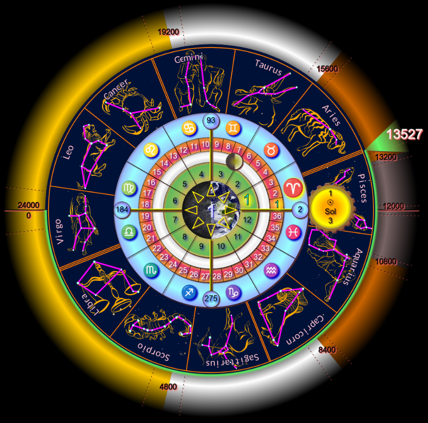

# calclock
webapp to display UCC dates (see https://ucc.zone) and to convert between UCC and Gregorian calendar dates.

This is a Progressive Web App (pwa) that is hosted at https://ucc.zone/apps/calclock/ and should offer
to install itself as a webapp if you visit that page.

UCC Çync shows today's Universal Celestial Çynchronometer date with its Gregorian equivalent and allows you to display any date in the current 24,000 year 'Great Year' and convert it to Gregorian format (and viçe versa). With Çync you can also Jump to any of the 12 Astrological Ages or 8 Yugas of Consciousness, to truly stay in Çync with our Universal Celestial Cycles.

The app is built on a library that handles the date/time calculations and conversions and the plan is to document the library, listing the UCCDate object properties and methods for use in other applications.